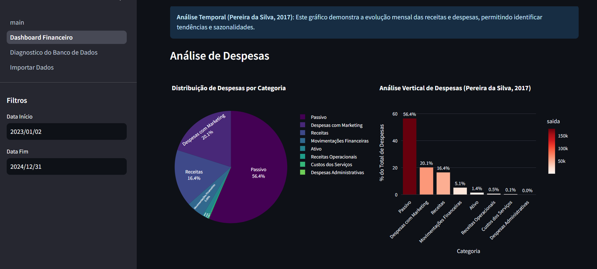
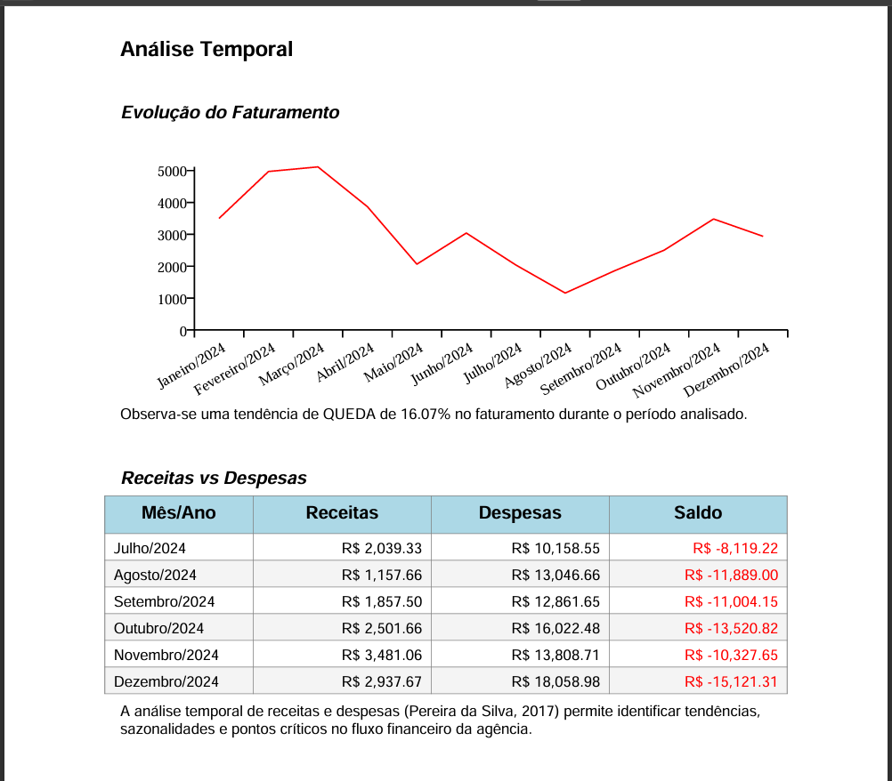

# Sistema de Gestão Contábil para Agência de Publicidade


Sistema para controle e análise financeira de agências de publicidade, desenvolvido com Python, Streamlit e PostgreSQL.

## 📋 Características

- Dashboard financeiro interativo
- Análise vertical de receitas e despesas
- Classificação de custos fixos e variáveis
- Cálculo do ponto de equilíbrio
- Análise de tendências e sazonalidade
- Geração de relatórios em PDF
- Importação de dados de planilhas CSV

## 📸 Screenshots

Veja abaixo algumas capturas de tela do sistema em funcionamento:

### Home

*Pagina inicial da aplicação*

### Dashboard Financeiro

*Dashboard com indicadores financeiros e análises gráficas*

### Relatório em PDF

*Exemplo de relatório financeiro gerado em PDF*


## 🚀 Inicializando a Aplicação

### Pré-requisitos

- [Docker](https://www.docker.com/get-started)
- [Docker Compose](https://docs.docker.com/compose/install/)
- [Git](https://git-scm.com/downloads)

### Instalação e Execução

1. Clone o repositório:
```bash
git clone https://github.com/seu-usuario/projeto-contabilidade.git
cd projeto-contabilidade
```

2. Inicie os containers com Docker Compose:
```bash
docker compose up
```

3. Acesse a aplicação:
- Abra seu navegador e acesse [http://localhost:8501](http://localhost:8501)

4. Para desenvolvimento com hot-reload, use:
```bash
docker compose watch
```

## 💾 Banco de Dados

O sistema usa PostgreSQL para armazenamento dos dados. Na primeira execução, o banco será inicializado automaticamente com as tabelas necessárias.

### Verificação do banco de dados

Para verificar o status do banco de dados, acesse a página "Diagnóstico do Banco de Dados" na aplicação.

## 📥 Importação de Dados

Para começar a usar o sistema:

1. Navegue até a página "Importar Dados"
2. Carregue um arquivo CSV contendo:
   - Data da movimentação
   - Banco e conta
   - Natureza contábil
   - Valores de entrada e saída
   - Histórico da movimentação

### Formato do CSV para importação

```
Data,Banco,Agencia,Conta Banco,Natureza,Nome Natureza,Documento,Entrada,Saida,Historico
01/01/2023,Banco X,1234,56789,1001,Receita de Vendas,NF-001,5000.00,0.00,Faturamento Cliente ABC
15/01/2023,Banco X,1234,56789,2001,Aluguel,BOL-123,0.00,1500.00,Pagamento aluguel sede
```

## 📊 Dashboard Financeiro

O Dashboard exibe:

- Indicadores financeiros principais
- Evolução de receitas e despesas
- Distribuição de despesas por categoria
- Análise de custos fixos e variáveis
- Ponto de equilíbrio
- Faturamento mensal

## 📄 Relatórios

Para gerar relatórios em PDF:

1. Acesse o Dashboard Financeiro
2. Selecione o período desejado usando os filtros
3. Role até o final da página
4. Clique no botão "Gerar Relatório PDF"
5. Faça download do arquivo gerado

## 🔧 Desenvolvimento

### Estrutura do Projeto

```
projeto/
├── docker-compose.yaml       # Configuração dos serviços Docker
├── Dockerfile                # Configuração da imagem Python
├── requirements.txt          # Dependências Python
├── alembic.ini               # Configuração do Alembic
├── migrations/               # Arquivos de migração do banco
├── src/
│   ├── main.py               # Ponto de entrada da aplicação
│   ├── database.py           # Configuração do banco de dados
│   ├── models.py             # Modelos SQLAlchemy
│   ├── report_generator.py   # Gerador de relatórios em PDF
│   ├── init_db.py            # Inicialização do banco
│   ├── import_excel.py       # Funções de importação
│   └── pages/                # Páginas Streamlit
│       ├── Dashboard_Financeiro.py
│       ├── Diagnostico_do_Banco_de_Dados.py
│       └── Importar_Dados.py
```

### Trabalhando com migrations

Para modificar a estrutura do banco de dados:

```bash
# Acesse o container
docker compose exec web bash

# Crie uma nova migração
alembic revision --autogenerate -m "descricao_da_alteracao"

# Aplique as migrações pendentes
alembic upgrade head
```

## 🔄 Workflow Git

O projeto utiliza [git-flow](https://danielkummer.github.io/git-flow-cheatsheet/index.pt_BR.html) para gerenciamento de branches.

```bash
# Inicializar git-flow (primeira vez)
git flow init

# Criar uma nova feature
git flow feature start nome-da-feature

# Finalizar uma feature
git flow feature finish nome-da-feature

# Criar uma release
git flow release start '0.x.0'

# Finalizar uma release
git flow release finish '0.x.0'
```

## 🐞 Troubleshooting

### Problemas de conexão com o banco

Se a aplicação não conseguir conectar ao banco de dados:

1. Verifique se o container do PostgreSQL está rodando: `docker compose ps`
2. Acesse a página de diagnóstico para mais detalhes
3. Verifique os logs: `docker compose logs db`

### Reiniciando o ambiente

Para reiniciar completamente o ambiente:

```bash
docker compose down
docker volume rm projeto-contabilidade_postgres_data
docker compose up
```

## 📚 Referências Contábeis

O sistema implementa conceitos da literatura contábil:

- **Pereira da Silva (2017)**:
  - Análise vertical
  - Análise de tendências
  - Índices financeiros

- **Martins (2018)**:
  - Classificação de custos fixos e variáveis
  - Índice de fixação
  - Ponto de equilíbrio

## 📄 Licença

Este projeto está licenciado sob os termos da licença MIT.

## 🤝 Contribuições

Contribuições são bem-vindas! Para contribuir:

1. Crie um fork do projeto
2. Crie uma branch para sua feature: `git checkout -b feature/nova-funcionalidade`
3. Faça commit das suas alterações: `git commit -m 'Adiciona nova funcionalidade'`
4. Envie para o branch: `git push origin feature/nova-funcionalidade`
5. Abra um Pull Request